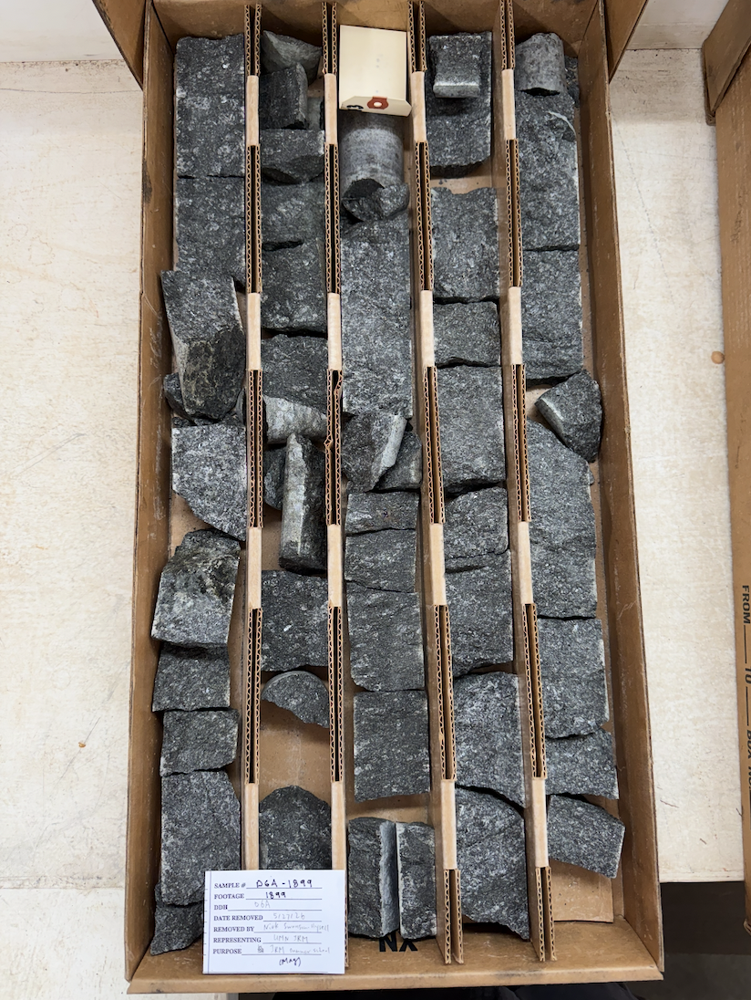

#

##


The core is arranged as follows (this example is box no. 185 that goes from 1895 to 1905 feet):

```
+-------+-------+-------+-------+-------+
| 1897  | 1899  | 1901  | 1903  | 1905  |
|       |       |       |       |       |
|       |       |       |       |       |
|       |       |       |       |       |
|       |       |       |       |       |
|       |       |       |       |       |
|       |       |       |       |       |
|       |       |       |       |       |
|       |       |       |       |       |
| 1895  | 1897  | 1899  | 1901  | 1903  |
+-------+-------+-------+-------+-------+
```

<p align="center">
  
</p>

## Photos

Photos were taken of each sample with up being down core with sample card to the left of the sample (i.e. higher in the core). 


