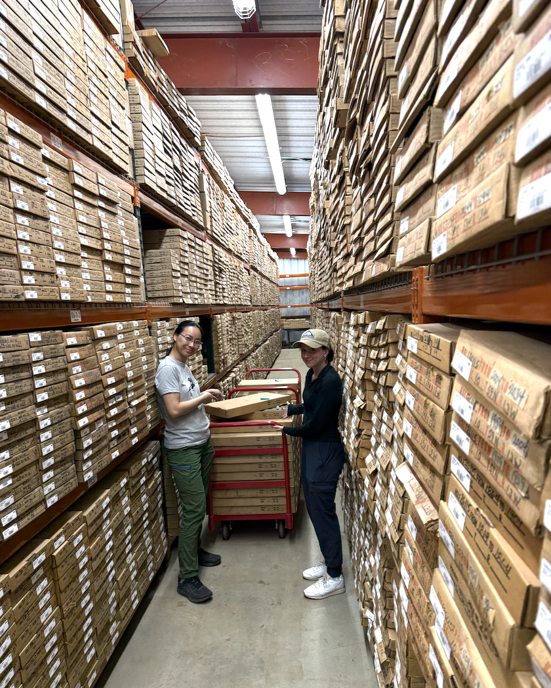
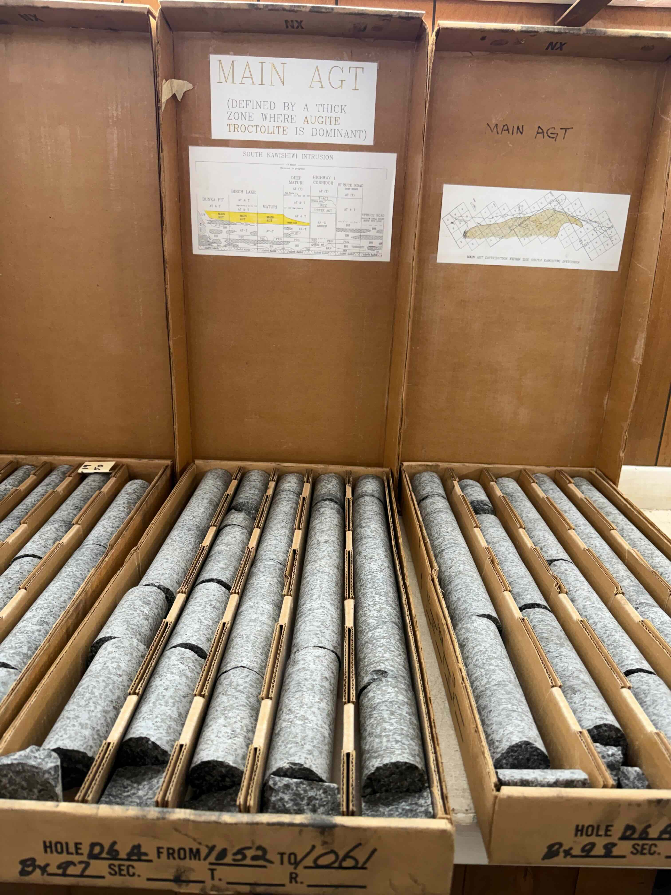
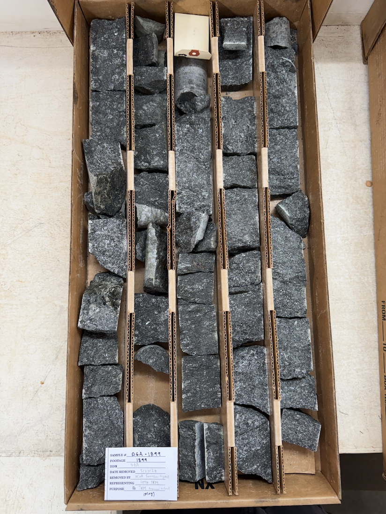

# Core examination and sampling

Documentation of drill hole D-6A itself, of the May 26–28, 2026 core examination at the Minnesota DNR Drill Core Library, and of the material collected. Samples are keyed by footage (depth from collar) so they can be cross-referenced against the [stratigraphic section](../D-6A_log/D_6A_stratigraphic_column.ipynb) and the geochemistry archived alongside it.

## The D-6A drill hole

D-6A (DNRNUM 13933) is an exploration hole in the Dunka Pit area of the South Kawishiwi intrusion (SKI), part of the ca. 1096 Ma Duluth Complex of northeastern Minnesota. The collar is at 47.6989°N, 91.8362°W (St. Louis County, Minnesota; PLSS location 10-60N-12W), with an end-of-hole depth of 2125 ft. These coordinates are from the Minnesota DNR Drill Core Library boring-location dataset (matched on DNRNUM 13933, reprojected from UTM Zone 15N / EPSG:26915 to WGS84).

The Severson log lists a collar elevation of 1521 ft; the DNR dataset gives 1517 ft. The same DNR dataset records the hole as vertical (dip −90°, azimuth 360°), drilled by diamond coring for exploration; this is the as-collared orientation rather than a downhole deviation survey.

The hole penetrates the South Kawishiwi Troctolitic Series — a layered sequence of anorthositic troctolite, augite troctolite, and ultramafic units — and bottoms in the Archean Giants Range Batholith footwall. It was logged by Mark Severson (NRRI) in 1992 as part of a major effort studying the layered series of the Duluth Complex. Geochemical datasets developed from the core are archived alongside the [stratigraphic section](../D-6A_log/D_6A_stratigraphic_column.ipynb), and the geologic context of the intrusion is described in the [geologic background](../Duluth_Complex_background/duluth_complex_background.md).

## The May 2026 core examination

The core was examined and sampled at the Minnesota DNR Drill Core Library in Hibbing, Minnesota, by Nick Swanson-Hysell, Mary Yao, and Kate Akin from May 26 to 28, 2026. Mark Severson's 1992 log was used as a scaffold for sampling and for additional observations recorded against the core.

<p align="center">
  
</p>
<p align="center">
  <em>Mary Yao and Kate Akin pulling D-6A core boxes in the Minnesota DNR Drill Core Library, Hibbing, Minnesota.</em>
</p>

<p align="center">
  
</p>
<p align="center">
  <em>D-6A core boxes 97 and 98 (1052–1061 ft) within the Main AGT. Severson affixed summaries of the South Kawishiwi Intrusion stratigraphy and the map distribution of the unit inside the box lids at unit boundaries.</em>
</p>

The core has been variably depleted by prior sampling. Some intervals survive only as quarter core, which limited or precluded additional sampling; those intervals are flagged in the [notes below](#additional-notes) and in the sample table.

Magnetic susceptibility was measured on the core during the examination with a handheld KT-10 susceptibility meter. The measurements, the instrument configuration, and the core-geometry caveats that bear on their interpretation are documented in [`../D-6A_data/`](../D-6A_data/measured_data.md).

## Sample inventory (`D-6A_samples.csv`)

[`D-6A_samples.csv`](D-6A_samples.csv) is the running table of samples taken from the core, one row per sample. Each sample is named `D6A-<footage>` (e.g. `D6A-2123`), where the footage is the depth from collar in feet. The table records both Severson's original log designations and our own hand-sample observations so the two can be compared.

| Column | Description |
|---|---|
| `sample name` | Sample identifier, `D6A-<footage>` |
| `footage` | Depth from collar, in feet, at which the sample was taken |
| `sample type` | Physical form of the sampled material — see values below |
| `Severson unit` | Stratigraphic-unit code from Severson's 1992 log (e.g. `MAIN AGT`, `GRB`) |
| `Severson description` | Severson's rock-type shorthand for the interval (e.g. `AGT HETEROGEN`, `MED. GRN GRANITE`) |
| `rock type` | Our interpreted rock type (e.g. `augite troctolite`, `quartz monzonite`) |
| `sulfide (%)` | Estimated visible sulfide content, in modal percent |
| `our description` | Our hand-sample description (grain size, texture, alteration, fabric) |

`sample type` records the form of core that was present and how the sample was taken. For the "… core core" values, a paleomagnetic (pmag) core was drilled out of the available core; for `quarter core`, the sample is the quarter-core piece itself. DNR policy requires that at least one quarter of the original core be preserved. Observed values:

- **full core core** — a full-diameter (NQ) core was present, and we drilled a pmag core out of it
- **half core core** — a half core was present, and we drilled a pmag core out of it
- **quarter core** — our sample is the quarter-core piece itself
- **core chip** — a small chip sample

## Core box layout

The core is arranged as follows (this example is box no. 185, which goes from 1895 to 1905 feet):

```
+-------+-------+-------+-------+-------+
| 1897  | 1899  | 1901  | 1903  | 1905  |
|       |       |       |       |       |
|       |       |       |       |       |
|       |       |       |       |       |
|       |       |       |       |       |
|       |       |       |       |       |
|       |       |       |       |       |
|       |       |       |       |       |
|       |       |       |       |       |
| 1895  | 1897  | 1899  | 1901  | 1903  |
+-------+-------+-------+-------+-------+
```

<p align="center">
  
</p>

## Photos

Photos were taken of each sample with up being down core, with the sample card to the left of the sample (i.e. higher in the core).

## Sample prep plans

Specimens are being prepared from the collected D6A samples by Marcus Lorenzen. They are being prepared for 5 IRM Summer School Groups: 
- Group AGT
- Group Ultramafic (1 and 3)
- Group BAN (Basal Augite Troctolite and Norite)
- Group Heterogenous (basal heterogenous unit)
- Group Felsic (GRB + Granophyre + DG6a-420 *oxidized augite troctolite*)

specimen *a* (prepped for every sample): specimen prepared for SRM remanence analysis. For cores drilled from core with pmag drill, "full core core" in "D-6A_sampling/D-6A_samples.csv", the specimen core axis lab arrow is horizontal. For specimens cut from the quarter core, the arrows indicate up (towards the surface).

specimen *b* (prepped for every sample): chip for rock magnetism put into capsule for VSM and MPMS experiments. For coarsely crystalline samples, the dominant mineralogy is noted and multiple rockmag specimens may be preped (*c*, *d*).

specimen *t*: polished thick section prepared for SEM analysis and QDM analysis. 3 prepared for Group AGT, Group BAN, and Group Felsic. 4 prepared for Group Heterogenous (2 anorthositic, 2 ultramafic) and 4 prepared for Group Ultramafic (2 U1, 2 U3)

## Additional notes

Notes made while looking at core on May 27–28, 2026:

The core was not cut in half but was rather broken in half, which makes it so that the split is rough and uneven.

We assess the contact between the basal norite and the Giants Ridge Batholith to be at 2030 feet rather than 2038 feet as in the Severson log.

1/4 core from 1915 to 1989 (no sampling possible)

The more natural split between Ultra 3 and the Basal Augite troctolite/Norite unit appears to be at 1872 rather than 1900

1/4 core from 1692 to 1625 (no sampling possible) which means that Ultramafic 2 is completely sampled

1/4 core from 1519 to 1528 (no sampling possible)

1/4 core from 1471 to 1500 (no sampling possible)

1/4 core from 1452 to 1461 (no sampling possible)

1/4 core from 1354 to 1445 (no sampling possible) which means that Ultramafic 1 is completely sampled

3:06 pm photo on 5/27/2026 at meter level 1575 in the basal heterogeneous zone between melatroctolite and anorthositic troctolite

The interval from 528 to 623 that is termed plag-rich within the 265 to 623 augite troctolite unit should be considered to be anorthositic troctolite

Just below the granophyre xenolith interval there is troctolite where all the olivine is replaced with dark red hematite alteration (i.e. iddingsite) (5/28/2026 3:30 pm photo and 2:43 pm photo of the D6A-)
