# Demag GUI tutorial

This tutorial walks through interpreting paleomagnetic demagnetization data with the **Demag GUI** tools in PmagPy: converting raw magnetometer files to MagIC format, making least-squares fits to demagnetization data, calculating site means, and preparing a contribution for the MagIC database. It uses thermal demagnetization data from a lava flow in the ca. 1084 Ma Michipicoten Island volcanics as the worked example.

It was originally developed for the 2023 MagIC workshop by the Swanson-Hysell Research Group. The data and images are included in this book under [`software_setup/Demag_GUI_tutorial/`](https://github.com/Institute-for-Rock-Magnetism/2026_SSRM_Duluth_Complex/tree/main/software_setup/Demag_GUI_tutorial).

:::{note}
This tutorial uses the standalone **Pmag GUI** application, which is a separate download from the RockmagPy Python environment set up in the [software setup guide](../rockmagpy_setup.md). The two are complementary: RockmagPy is for rock magnetic experiments (hysteresis, susceptibility, low-temperature), while Demag GUI is for interpreting directional demagnetization data.
:::

## Prior to tutorial

### Download the Pmag_GUI executable program

Download the latest release of the PmagPy GUI software:

- **Mac:** <https://github.com/PmagPy/PmagPy-Standalone-OSX/releases/latest>
- **Windows:** <https://github.com/PmagPy/PmagPy-Standalone-Windows/releases/latest>
- **Linux:** <https://github.com/PmagPy/PmagPy-Standalone-Linux/releases>

The PmagPy standalone apps are not signed by an Apple-verified developer, so both macOS and Windows will try to block them the first time you open them. This is expected, and the app is safe to run — you just have to tell the operating system to allow it. The steps below only need to be done once per download.

Note that the software, particularly the Windows version, can take a long time to load. Be patient.

::::{admonition} Opening the app on macOS
:class: important

How you get past macOS security depends on your macOS version. To check, click the Apple menu → *About This Mac*.

**macOS Sequoia (15) and later.** Apple removed the old right-click → *Open* shortcut, so you now go through System Settings:

1. Double-click the app. A dialog says it can't be opened because Apple can't check it for malicious software. Click **Done** (do *not* click *Move to Trash*).
2. Open the Apple menu → **System Settings** → **Privacy & Security**.
3. Scroll to the bottom, to the **Security** section. You'll see a line naming the app that was just blocked, with an **Open Anyway** button. Click it.
4. Authenticate with Touch ID or your password, then click **Open Anyway** (or **Open**) in the confirmation dialog.

The app opens from then on by double-clicking as normal.

**macOS Sonoma (14) and earlier.** Right-click (or Control-click) the app icon, choose **Open**, and click **Open** in the dialog that appears. You may need to do this twice.

:::{tip} If no "Open Anyway" button appears
On some macOS versions the *Open Anyway* button doesn't show up, or the app reports that it is "damaged and can't be opened." When that happens, remove the quarantine flag from the command line. Open the **Terminal** app (press <kbd>⌘ command</kbd>+<kbd>space</kbd> to open Spotlight, type `terminal`, and press <kbd>return</kbd>), then in the Terminal window type `xattr -c ` — including the trailing space — drag the Pmag GUI app onto the window so its path is filled in, and press <kbd>return</kbd>. Then open the app normally.
:::
::::

:::{admonition} Opening the app on Windows
:class: important

When you run the downloaded `.exe`, Windows may show a blue **"Windows protected your PC"** screen from SmartScreen. Click **More info**, then **Run anyway**. This appears because the app is not signed by a recognized developer, not because anything is wrong with it.
:::

### Get the tutorial data

The raw data used below are included in this book in the [`data/`](https://github.com/Institute-for-Rock-Magnetism/2026_SSRM_Duluth_Complex/tree/main/software_setup/Demag_GUI_tutorial/data) folder alongside this page. If you have cloned or downloaded the book repository you already have them; otherwise download that folder so you have the `SS20-` and `Fairchild2017` data directories to work with.

:::{admonition} Quick download of the tutorial data
:class: tip

The fastest way to get everything you need is to download this zip archive of the original tutorial repository (~3 MB):

**<https://github.com/Swanson-Hysell-Group/2023_Demag_GUI_tutorial/archive/master.zip>**

Unzip it and you will have a `2023_Demag_GUI_tutorial-master` folder containing the `data/SS20-` and `data/Fairchild2017` directories used below. Make note of where you unzipped it, as you will need to navigate to these folders from within Pmag GUI.
:::

## Tutorial instructions

### Data conversion to MagIC format

In this example, we are going to convert data for one site that is a lava flow within the ca. 1084 Ma Michipicoten Island volcanics. These data were published in <https://doi.org/10.1130/L580.1> with data that have been contributed to the MagIC database <https://earthref.org/MagIC/11883>. For the example we will work through, the data are not yet in MagIC format, but rather in the CIT lab format which includes a .sam site level file and ascii sample text files as described here: <http://cires1.colorado.edu/people/jones.craig/PMag_Formats.html>. While the specifics of this workflow will vary with different lab formats, this demonstration will show how Pmag_GUI can be used to convert data to MagIC format using the following steps:

1. Open the Pmag GUI executable program

2. Navigate to the `data/SS20-` folder that has the `SS20-.sam` file in it when you are initially prompted to pick a directory, or change the directory to be that folder.

3. Click on *1. Convert magnetometer files to MagIC format* in the Pmag GUI home window

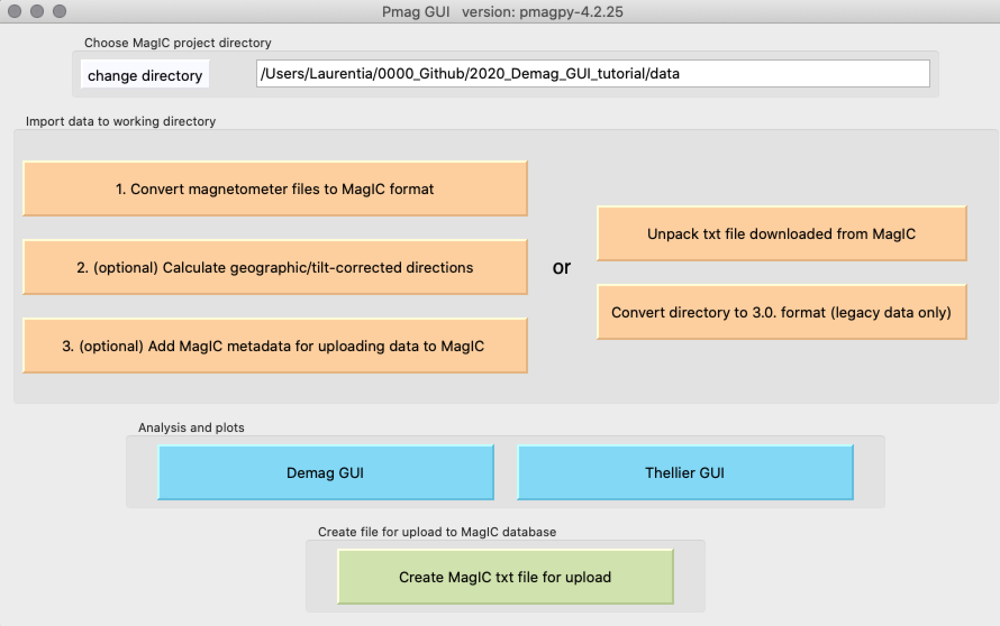

4. The files that we are dealing with are CIT format. In the *step 1: choose file format* window, click the button for CIT format and then click *Import file*.

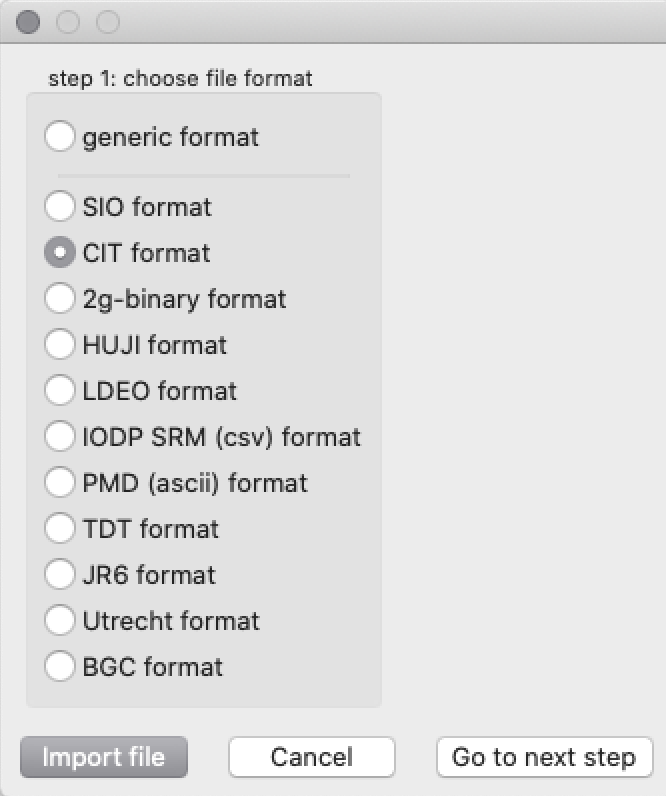

5. In the PmagPy CIT file conversion window, choose the SS20-.sam file and then select the sampling particulars as shown below. Leave the lab field blank as these are thermal demagnetization data. Specify the sample-site naming convention to be XXXX-YY and leave the delimiter blank. Specify the number of terminal characters that distinguish specimen from sample (1). Enter the location name (in this case Michipicoten Island). Leave the defaults for replicate measurements and number of measurement orientations. When all of this information is entered, press ok.

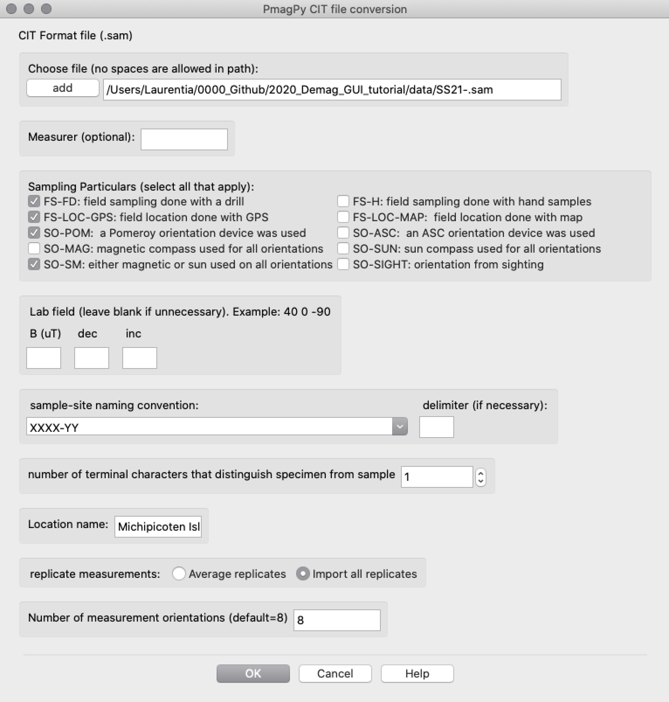

6. Click on *Go to next step* in the step 1 dialog box.

7. Click OK in the *Step 2: Combine different MagIC files* box.

8. Click OK in the *Step 3: Combine different MagIC formatted files* box.

Following this step, you should see this message indicating that these files have been created.

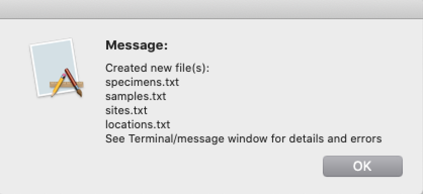

These are MagIC format files and these MagIC formatted files can be used for analysis in Demag_GUI. If you had more than one site to convert to MagIC format, you would repeat the *1. Convert magnetometer files to MagIC format* step multiple times and use the *step 2* and *step 3* dialog boxes to merge all of the site level data into a single set of MagIC tables.

### Data visualization and analysis of the converted data

Now that the SS20 site data have been converted to MagIC format, we can use the Demag GUI tools within Pmag GUI to visualize the data and to interpret directions through making least-squares fits.

1. You should now be returned to the main Pmag GUI page. Click on the blue Demag GUI button to launch the visualization and analysis tools for these demagnetization data.

2. You should see a panel that looks like the below showing the data for the first specimen in the site. Note that you can customize your view of the data switching between coordinate systems (e.g. specimen, geographic, tilt-corrected) and changing whether the x-axis is north or east for the vector component plot. In this case, let's change our coordinate system to be geographic or tilt-corrected.

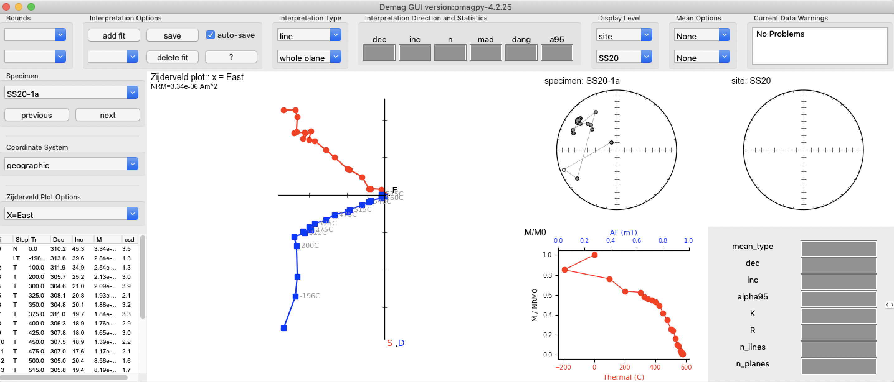

3. Let's make fits to the high-temperature component that dominantly unblocks between 400ºC and 580ºC. To make a fit you can click add fit or double-click in the box that lists the steps. You can adjust the bounds of the fit by double-clicking in the steps box or by selecting the upper and lower bounds from the drop-down bounds menus. You can change the name of the fit by selecting the default fit name *Fit 1*, changing the name, and pressing enter. Perhaps you want to call this the **HT** (high-temperature fit) as there is also a low-temperature component revealed in the thermal demagnetization data.

4. Let's go through and make HT fits for all the samples in the site.

5. You will note that there are some specimens for which there were multiple measurements made at a given temperature step (for example the 570ºC step for specimen SS20-2a). In this case, the specimen was remeasured given the csd angle. If multiple measurements at the same step are included in a fit, there will be a warning in the *Current data warnings* window that says *Within Fit HT, there are multiple good measurements at the 570C step. All good measurements are included in the fit.* In this case, it can make sense to mark one of the measurements as *bad*. This can be done by right-clicking on the step which will mark the measurement as bad in the measurements.txt table and exclude it from any fits.

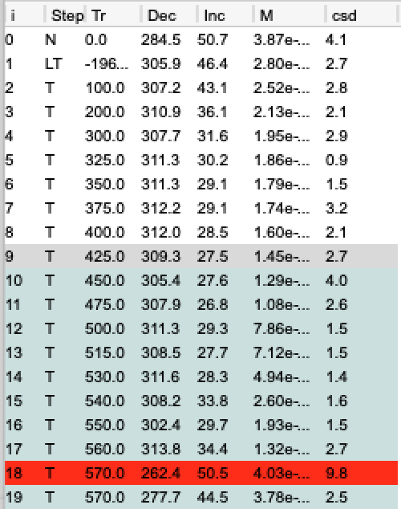

6. We can visualize fits for all the specimens in the site and calculate the Fisher mean by choosing the *Display Level* and the *Mean Options* in the upper right.

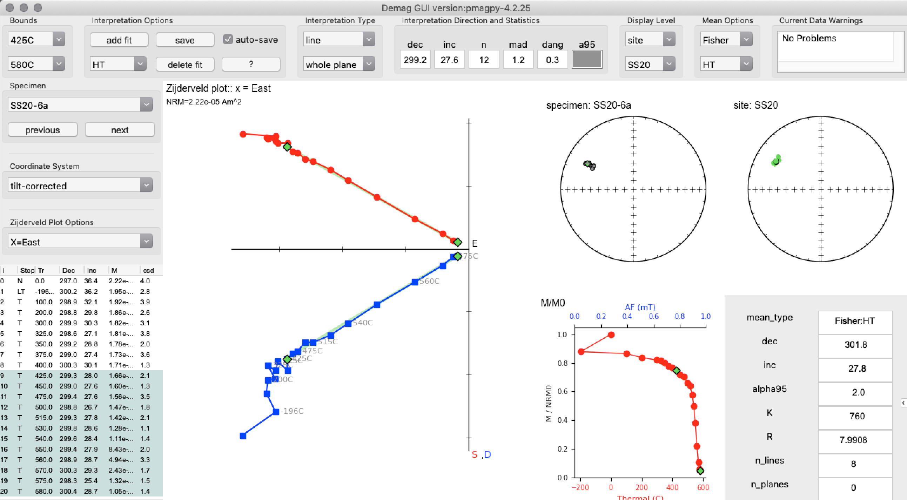

7. Once we have made the fits, let's look at them in the Tools > Interpretation Editor view. This panel provides helpful tools to make bulk changes to fits and to add new fits to all specimens.

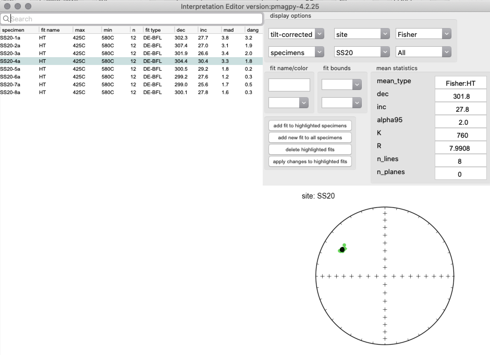

8. The parameters for the least-squares fits can be saved into a lightweight file called a .redo file that specifies the bounds, the fit name, the fit type and the color. Let's save that file by clicking on the save option in Interpretation options.

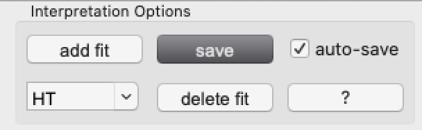

9. Go ahead and find this file and have a look at it. It is a tab-delimited file with the specimen name, type of fit, lower bound, upper bound, fit name, color, and a flag for good (g) or bad (b). Note that the temperatures are in Kelvin. This file can be imported in order to keep working on fits without saving the fits to the final MagIC tables.

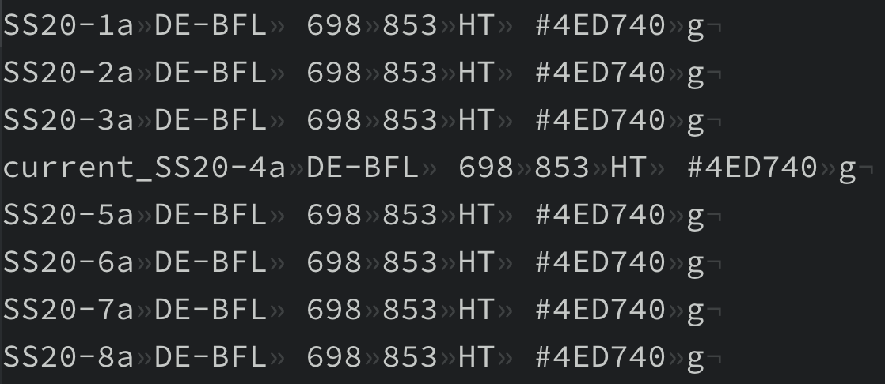

### Converting to MagIC format

1. To get these fits saved into MagIC format, we go to File > Save MagIC tables in Demag_GUI. Let's choose to save the specimen, geographic, and tilt-corrected coordinate systems to the MagIC specimens table.

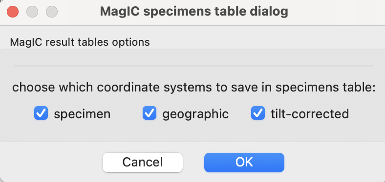

2. We have some additional choices to make within the next dialog box as pertain to the sample. In this case, it makes sense to save the site directions in both geographic and tilt-corrected coordinates. We can also have Demag GUI calculate the virtual geomagnetic pole (VGP) position. By checking the age box, we can add age information as well. In this case, the lava flow that was studied is bracketed by an underlying tuff with a U-Pb date.

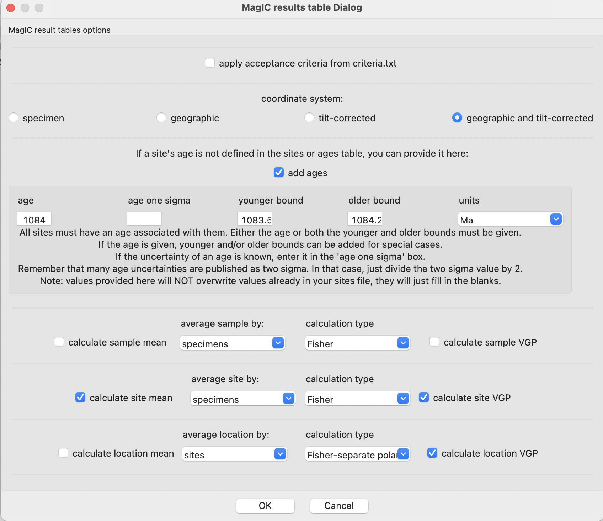

3. Once you have saved the MagIC tables out of Demag_GUI, close the Demag_GUI window which will bring you back to the Pmag_GUI window. Here you can click the green button *Create MagIC txt file for upload*.

4. For these data, you will get an error message saying that the validation of the upload file has failed. That is because the CIT file that we converted did not contain all of the required metadata for contribution to MagIC. What should then come up is a validations window that provides help with adding the additional required fields. *In the current version, this window comes up for the OSX program, but not the Windows one.*

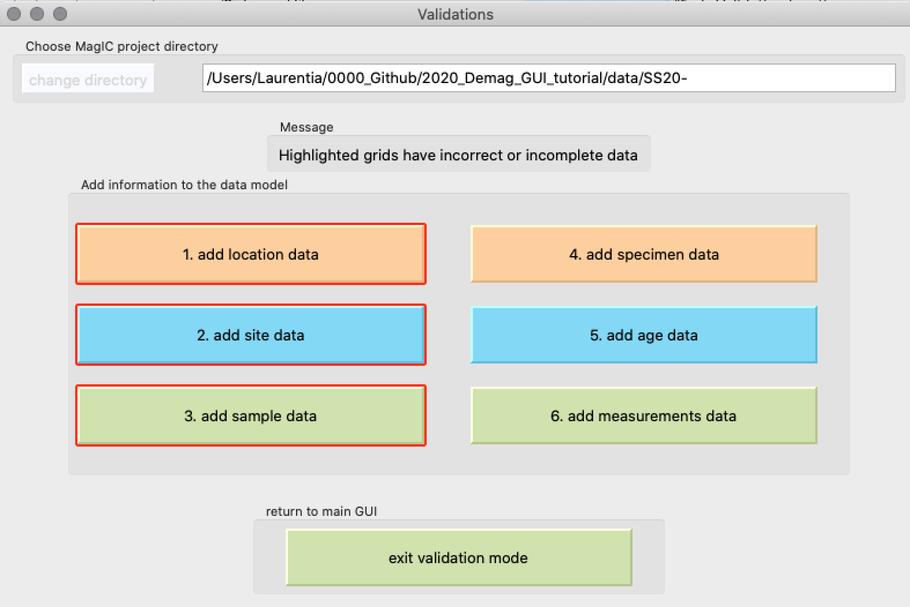

5. These fields can be added using the validation GUI or can be added directly to the MagIC tables in a text or spreadsheet editor. Let's go ahead and open the contribution in a spreadsheet editor which will give us the experience of seeing the structure of the tables. We can fill in the missing data fields while referring to the controlled vocabulary that is linked to from the MagIC data model: <https://www2.earthref.org/MagIC/data-models/3.0>.

### Contributing to MagIC

Now we can take our MagIC contribution with our fits and upload it into our private workspaces in MagIC: <https://www2.earthref.org/MagIC/upload>. Let's do so and walk through the steps together.

## Unpacking and visualizing data from a MagIC contribution

1. The data from this study has been contributed to the MagIC database. Go here to download it <https://earthref.org/MagIC/19680> or you can find it in the [`data/Fairchild2017`](https://github.com/Institute-for-Rock-Magnetism/2026_SSRM_Duluth_Complex/tree/main/software_setup/Demag_GUI_tutorial/data/Fairchild2017) folder alongside this page.

2. Click on Unpack txt file downloaded from MagIC.

3. Navigate to the `magic_contribution_17114.txt` file.

4. Change the MagIC project directory to be the folder in which the MagIC file was unpacked.

5. Click on Demag GUI to look at the data from this study and the associated fits.

---

*This tutorial was originally developed for the [2023 MagIC workshop](https://github.com/Swanson-Hysell-Group/2023_Demag_GUI_tutorial).*
