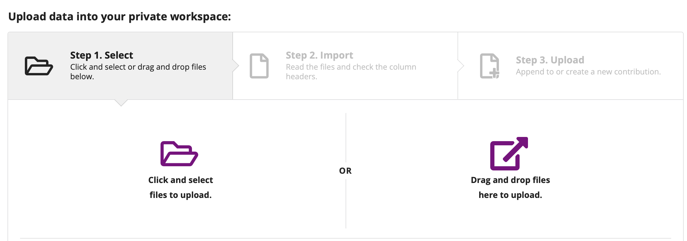
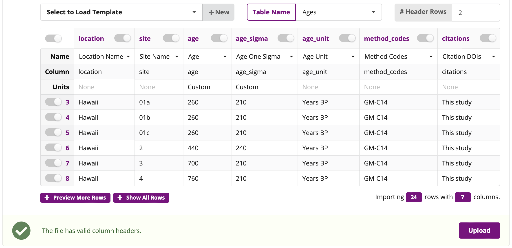
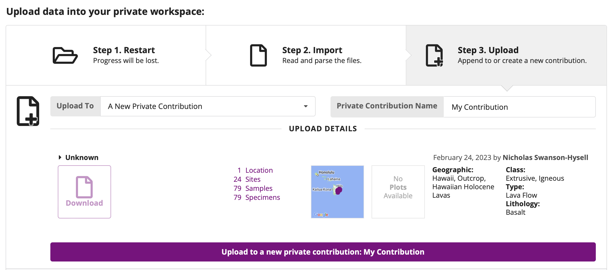
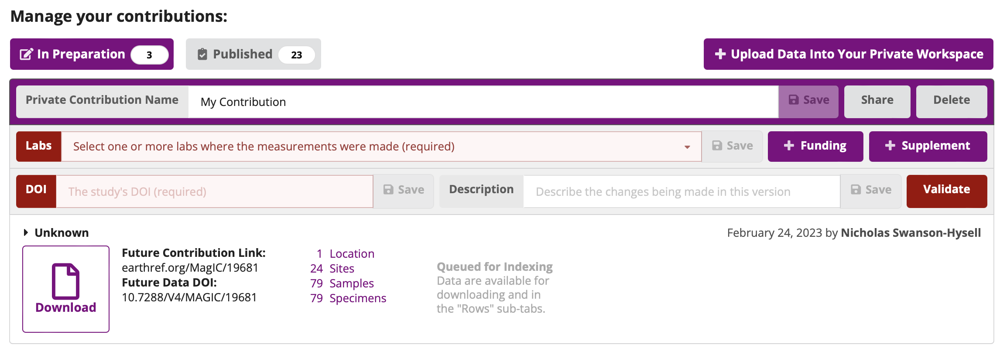
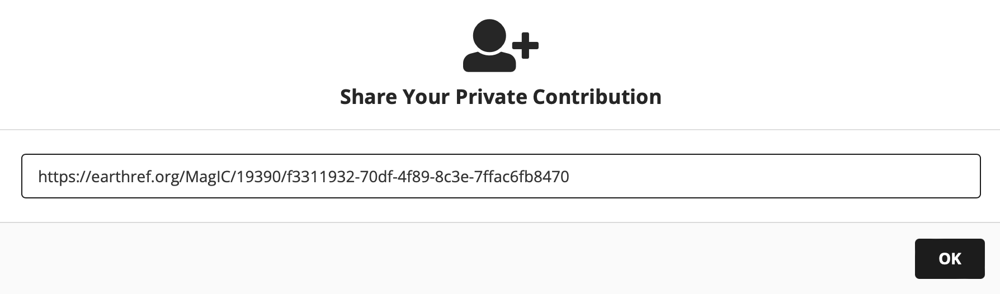

# Uploading your data to MagIC

The rock magnetic measurements you make this week are analyzed with [RockmagPy](https://pmagpy.github.io/RockmagPy-notebooks), whose notebooks read data from [MagIC](https://earthref.org/MagIC). This page is how your group's data get there.

You do not have to publish anything to do this. A contribution uploaded to MagIC starts life **private** — visible only to you — and it stays that way until you choose to publish it. That is the state we want this week: your data in the database, reachable from a notebook, shareable with the people you are working with, and not yet public (being public requires being associated with a publication).

There is a real benefit to working this way rather than passing files around. Your data get validated against the data model as soon as they are uploaded, so problems surface immediately rather than at submission. A contribution gets a DOI reserved at upload, so it can be cited in a manuscript before it is published. And anyone you share the link with — a collaborator, a reviewer — sees exactly the same data you do.

:::{note}
This page picks up where the [software setup guide](../rockmagpy_setup.md) leaves off: it assumes you have a working `rockmag` environment and can open the RockmagPy notebooks in JupyterLab.
:::

## Before you start

You need your measurements exported from the IRM database in MagIC format. That is a single text file holding all of the tables one after another, in the format described by the [MagIC data model](https://earthref.org/MagIC/data-models/3.0). Ask at the instrument station if you are not sure whether your export has been made.

The exports from the July 22 measurements are in the [tutorial repository](https://github.com/Institute-for-Rock-Magnetism/2026_SSRM_MagIC_RockmagPy_tutorial) under `data/group_files_July22/`, one file per group. Download the file for your group with the raw link below (right-click → **Save Link As**), or work with your local clone of that repository if you have one:

| Group (MagIC location) | File | Raw download link |
| --- | --- | --- |
| `D6A-AGT` | `D6A-AGT.TXT` | <https://raw.githubusercontent.com/Institute-for-Rock-Magnetism/2026_SSRM_MagIC_RockmagPy_tutorial/main/data/group_files_July22/D6A-AGT.TXT> |
| `D6A-BAN` | `D6A-BAN.TXT` | <https://raw.githubusercontent.com/Institute-for-Rock-Magnetism/2026_SSRM_MagIC_RockmagPy_tutorial/main/data/group_files_July22/D6A-BAN.TXT> |
| `D6A-BH` | `D6A-BH.TXT` | <https://raw.githubusercontent.com/Institute-for-Rock-Magnetism/2026_SSRM_MagIC_RockmagPy_tutorial/main/data/group_files_July22/D6A-BH.TXT> |
| `D6A-felsic` | `D6A-felsic.TXT` | <https://raw.githubusercontent.com/Institute-for-Rock-Magnetism/2026_SSRM_MagIC_RockmagPy_tutorial/main/data/group_files_July22/D6A-felsic.TXT> |
| `D6A-ultramafic` | `D6A-ultramafic.TXT` | <https://raw.githubusercontent.com/Institute-for-Rock-Magnetism/2026_SSRM_MagIC_RockmagPy_tutorial/main/data/group_files_July22/D6A-ultramafic.TXT> |

You also need an EarthRef account. If you do not have one, make one at <https://earthref.org> — you can sign in with your ORCID.

## 1. Upload the file

Go to the MagIC upload tool at <https://earthref.org/MagIC/upload> and drag your file into it.



MagIC parses the file, splits it into its tables, and matches each column against the data model. This is your first validation: if a column name is not one the model knows, or a value is not in the controlled vocabulary for that column, you find out here.



Click **Upload** at the lower right, then click through to put the data into your private workspace.



## 2. Add the lab

In the contribution management page, set the lab for the study to **Institute for Rock Magnetism** and save.



## 3. Get the contribution ID and share key

Your contribution now has an **ID** — the number shown on the contribution page. You need it, plus a **share key**, to read the data from a notebook.

Click **Share** to generate the key. What you get is a private link containing both pieces:



The link looks like this:

```
https://earthref.org/MagIC/20426/5272749a-9af6-413c-8d94-28e1d99befe1
```

The number after `MagIC/` is the contribution ID (`20426` here) and the long string after it is the share key. Those are the two values you will paste into a notebook.

## 4. Read it in a notebook

With those two values, this is all it takes:

```python
import pmagpy.ipmag as ipmag
import pmagpy.contribution_builder as cb

magic_id = '20426'                                    # your contribution ID
share_key = '5272749a-9af6-413c-8d94-28e1d99befe1'    # your share key
dir_path = 'data/magic_downloads/my_contribution'

result, magic_file = ipmag.download_magic_from_id(magic_id,
                                                  directory=dir_path,
                                                  share_key=share_key)
ipmag.unpack_magic(magic_file, dir_path, print_progress=False)

contribution = cb.Contribution(dir_path)
measurements = contribution.tables['measurements'].df
```

Published contributions are fetched the same way with the `share_key` argument left off. The RockmagPy notebooks are written so that this cell is the only thing you change to move from the example data to your own — fill in the two values, and everything downstream is unchanged.

**A share key is a credential.** It gives anyone who has it access to unpublished data. Share it with the people you mean to share it with, and think before committing one to a public repository.

## Uploading again after you have made interpretations

The notebooks write the parameters you derive — $M_s$, $B_c$, Verwey transition temperatures — back into the specimens table of the contribution, and end by writing the whole contribution back out to a MagIC file:

```python
ipmag.contribution_to_magic(contribution, dir_path=dir_path)
```

That file can go back through the upload tool exactly as before, which updates your contribution so that the interpretations sit alongside the measurements they were derived from. This is the loop the whole week is built around, and it is what makes a result reproducible: someone reading your contribution gets the measurements, the interpreted values, the method codes saying how they were obtained, and the parameters used to obtain them.
